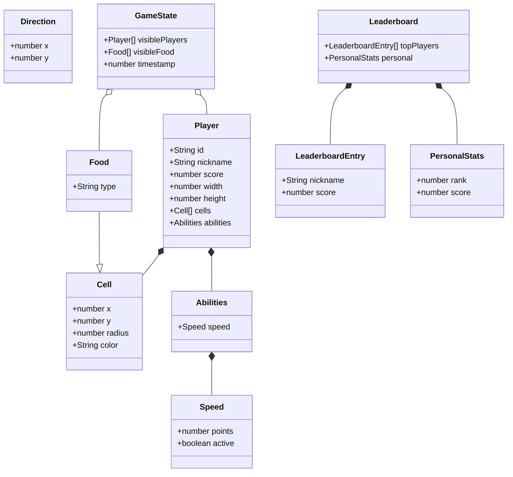

# Game Entities Class Diagram

```mermaid
classDiagram
    class Player {
        +String id
        +String nickname
        +number score
        +number width
        +number height
        +Cell[] cells
        +Abilities abilities
    }

    class Cell {
        +number x
        +number y
        +number radius
        +String color
    }

    class Food {
        +String type
    }

    class Abilities {
        +Speed speed
    }

    class Speed {
        +number points
        +boolean active
    }

    class Direction {
        +number x
        +number y
    }

    class GameState {
        +Player[] visiblePlayers
        +Food[] visibleFood
        +number timestamp
    }

    class LeaderboardEntry {
        +String nickname
        +number score
    }

    class PersonalStats {
        +number rank
        +number score
    }

    class Leaderboard {
        +LeaderboardEntry[] topPlayers
        +PersonalStats personal
    }

    %% Relationships
    Food --|> Cell
    Player *-- Cell
    Player *-- Abilities
    Abilities *-- Speed
    GameState o-- Player
    GameState o-- Food
    Leaderboard *-- LeaderboardEntry
    Leaderboard *-- PersonalStats
```
